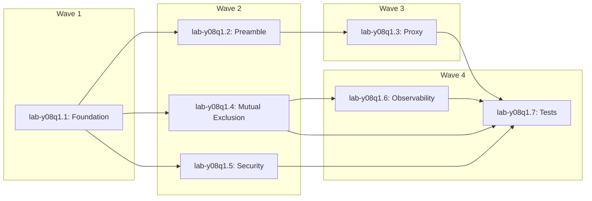

# Epic: lab-y08q1 — Code Mode: Full Cloudflare-Parity Implementation

**Status:** ✓ CLOSED (P0)  
**Owner:** Jacob Magar  
**Type:** Epic  
**Created / Closed:** 2026-05-27  
**Branch:** `bd-work/code-mode-cloudflare-parity`  
**Worktree:** `/home/jmagar/workspace/lab-code-mode`  
**PR:** #78

---

## What

Ship a Code Mode implementation as close to Cloudflare's version as physically possible on self-hosted hardware. No deferrals. No half-measures. No "move toward" language.

**Target:** [Cloudflare Code Mode](https://developers.cloudflare.com/agents/api-reference/codemode/)

One `code` tool. Typed TypeScript catalog injected into every execution. Model reads types, writes typed code, sandbox routes calls to host broker, host dispatches to real upstream servers, final return value comes back as the result. No discovery round-trip. No separate tools.

---

## Cloudflare References

- https://developers.cloudflare.com/agents/api-reference/codemode/
- https://blog.cloudflare.com/code-mode-mcp/
- https://blog.cloudflare.com/dynamic-workers/

---

## Epic Scope — What Ships

### Typed Preamble (the whole point)
- Generate real TypeScript `declare namespace codemode` declarations from upstream tool inputSchema at execution time
- Typed function signatures with real params (not `any`, not JSON array)
- Return types: `Promise<unknown>` is correct — MCP doesn't expose output schemas
- JSDoc from tool descriptions
- `callTool<T = unknown>(id: \`upstream::${string}::${string}\`, params: Record<string, unknown>): Promise<T>` as escape hatch
- `__catalog__` fallback when catalog exceeds 256KB soft cap — some tools get dropped, model is notified
- `codemode.__meta__.upstreams()` meta namespace for connected upstream discovery

### Response Shape (matching Cloudflare ExecuteResult)
- `result: Option<Value>` — final return value of the async function
- `calls: Vec<CodeModeExecutedCall>` — all intermediate tool calls
- `logs: Vec<String>` — captured console.log/warn/error from sandbox
- Truncation sentinel when a single call result exceeds budget

### Sandbox
- JavaScript Proxy-like mechanism to intercept `codemode.*` calls in Boa engine (in-process)
- JS preamble injection for Javy/QuickJS subprocess path
- Proper process group cleanup (`process_group(0)`) — kills grandchildren, not just direct child
- `prctl(PR_SET_DUMPABLE, 0)` in runner binary (prevents `/proc/environ` readback)
- Fuel budget: Boa (1M iterations, 16KB stack, 256 recursion), Javy (64MB memory, 5s timeout)
- Timeout enforcement and max tool calls enforcement

### Scope Model (full enforcement)
- `lab:read` → catalog preamble generation only (`CodeModeBroker::can_read()`)
- `lab`/`lab:admin` → callTool/codemode.* execution (`CodeModeBroker::can_execute()`)
- Per-subaction gating inside the code tool handler — NOT at tool boundary

### Mutual Exclusion (complete)
- `gateway_code_mode_enabled()` delegation bug fixed (was calling `tool_search_enabled()`)
- `validate_mode_exclusive()` shared helper in `dispatch/gateway/config.rs`
- Enforcement in `LabConfig::validate()` + `validate_config()` + inside `config_mutation.lock()`
- Startup conflict behavior: tool_search wins, ERROR log
- `ConfigError::DualModeConflict` variant

### Tool Rename (Cloudflare naming)
- `tool_search` → `search`, `tool_execute` → `execute`
- Legacy aliases hidden from `list_tools` with `tracing::warn!`
- Scope guards on all alias arms

### Observability (not deferred)
- Mode-change `tracing::info!` event on every transition (mode, enabled, previous fields)
- Per-execution metrics: tool_calls, elapsed_ms, result_bytes, logs_count, truncated — emitted from `CodeModeBroker::execute` boundary
- `tracing::warn!` on every legacy alias invocation
- `tracing::warn!` when catalog is truncated (soft cap exceeded)

### Error Taxonomy (complete)
- All kinds from contract: unknown_tool, unknown_action, auth_failed, server_error, internal_error, decode_error, missing_param, invalid_param, validation_failed, confirmation_required, rate_limited, timeout, network_error, tool_call_limit_exceeded, code_mode_timeout, code_mode_fuel_exhausted
- JSON error format: `{"kind":"...","message":"..."}` — not bare strings
- `LAB_ACTION_UNKNOWN_TOOL_HINT` references canonical names (search/execute)
- Structured errors surfaced to sandbox as catchable `CodeModeError` objects

### UI / Docs / Config
- Gateway admin UI: `handleToggle` guard + SWR cross-revalidation
- `GATEWAY.md`: two exclusive modes documented, no stale examples
- `config.example.toml`: mutual exclusion warning
- `CODE_MODE_SPEC` and `CODE_NODE_CONTRACT` match implementation
- Post-deploy smoke test documented

### Tests (full coverage)
- Mode snapshot tests with INVERSE assertions (presence + absence per mode)
- `gateway_code_mode_enabled()` delegation bug regression
- Mutual exclusion TOCTOU test
- Per-subaction scope gating for code tool
- Legacy alias hidden from list_tools
- Typed preamble generation test (real TypeScript output)
- result + logs in response
- Truncation sentinel test
- Startup dual-mode conflict test

---

## Source of Truth Documents

- `docs/specs/CODE_MODE_SPEC_FOR_RETARD_AGENTS.md` — implementation spec
- `docs/contracts/CODE_NODE_CONTRACT_FOR_RETARD_AGENTS.md` — agent contract

---

## Research Findings (from 8-agent research phase)

| Finding | Severity | Resolution |
|---------|----------|------------|
| `gateway_code_mode_enabled()` calls `tool_search_enabled()` — STOP CONDITION | CRITICAL | Fixed in Bead 1 |
| Error rejection produces plain string not JSON — breaks contract error recovery | CRITICAL | Fixed in Bead 1 |
| `CodeModeExecutionResponse` missing `result` and `logs` fields | CRITICAL | Fixed in Bead 1 |
| `codemode` namespace not registered in either sandbox — `ReferenceError` | CRITICAL | Fixed in Bead 3 |
| `allow_destructive_actions` is dead code — gate never checked | SECURITY | Fixed in Bead 5 |
| `/proc/environ` readable by subprocess — exposes LAB_MCP_HTTP_TOKEN | SECURITY | Fixed in Bead 5 |
| Process group leak — grandchildren survive `terminate_code_mode_runner()` | BUG | Fixed in Bead 5 |
| TS declarations and JS preamble are different artifacts — confusion risk | ARCHITECTURE | Clarified in Bead 2 |
| Token estimation bytes/4 underestimates (real ≈ bytes/3 for JSON) | PERF | Made configurable in Bead 5 |
| Cold catalog race: `lab:read` gets empty catalog on startup | BUG | Fixed in Bead 1 |

---

## Child Beads

| Bead | Title | Status | Priority |
|------|-------|--------|----------|
| [lab-y08q1.1](#bead-1-foundation) | Foundation — stop conditions, error format, response shape | ✓ CLOSED | P0 |
| [lab-y08q1.2](#bead-2-typed-preamble) | TypeScript preamble codegen and delivery channel | ✓ CLOSED | P0 |
| [lab-y08q1.3](#bead-3-proxy-namespace) | Runtime Proxy namespace, console capture and __meta__ | ✓ CLOSED | P0 |
| [lab-y08q1.4](#bead-4-mutual-exclusion) | Mutual exclusion, tool rename and AtomicBool | ✓ CLOSED | P0 |
| [lab-y08q1.5](#bead-5-security) | Security hardening — prctl, process group, destructive gate, redaction | ✓ CLOSED | P0 |
| [lab-y08q1.6](#bead-6-observability) | Observability, code normalization and docs/UI/config sync | ✓ CLOSED | P0 |
| [lab-y08q1.7](#bead-7-tests) | Full test coverage with inverse assertions | ✓ CLOSED | P0 |

**Open child beads:**

| Bead | Title | Status | Priority |
|------|-------|--------|----------|
| [lab-y08q1.2.2](#open-bead-preamble-cache) | get_preamble cache hit still fetches catalog | ○ OPEN | P3 |
| lab-y08q1.1.4 | Layering violation: dispatch imports from mcp/catalog | ○ OPEN | P3 |

**Dependency waves:**



---

## Bead 1: Foundation {#bead-1-foundation}

**lab-y08q1.1** · Code Mode: foundation — stop conditions, error format, response shape  
**Status:** ✓ CLOSED · P0

### What (fixed four blocking issues)

**1. gateway_code_mode_enabled() delegation bug (STOP CONDITION)**  
`mcp/catalog.rs:65-69`: called `manager.tool_search_enabled()` instead of reading `cfg.code_mode.enabled`. Code Mode tool never appeared in catalog even when enabled. Fixed: reads `manager.code_mode_enabled()`.

**2. JSON error format bug**  
`code_mode.rs:~1336`: sandbox error rejection produced plain string `"kind: message"`. Contract specifies `JSON.parse(e.message)` to parse a `CodeModeError` object. Both Boa and Javy paths now reject with `serde_json::to_string()` on a `{"kind":"...","message":"..."}` struct.

**3. Missing result + logs in CodeModeExecutionResponse**  
Added:
- `result: Option<serde_json::Value>` — final return value of the async function
- `logs: Vec<String>` — captured console.log/warn/error lines

**4. Cold catalog race fix**  
`allow_cold_connect = caller.can_execute()` correctly blocks `lab:read` from triggering cold connects, but this meant empty catalog for read-only callers on startup. Fix: warm-up trigger in `set_code_mode_config()` when `enabled` transitions `false → true`, and in startup path at `manager.rs:545`.

### Key Decisions
- JSON error format: `{"kind":"...","message":"..."}` — matches CodeModeError in contract doc
- `result` field type: `Option<serde_json::Value>` — None when function returns undefined/throws
- `logs` field type: `Vec<String>` — populated in Bead 3, empty Vec here
- `allow_cold_connect` gate at `code_mode.rs:252` preserved — `lab:read` must not pay cold-start cost per-request

### Lessons Learned
- `LEARNED`: Both Boa and Javy paths had identical error format bug — plain 'kind: message' string rejection. Both fixed to produce `JSON.stringify({kind, message})`.
- `LEARNED`: `unwrap_or_else` fallback with unescaped string interpolation is a subtle injection vector — when the fallback constructs JSON by interpolating runtime values (`{kind}`), any quote/backslash produces malformed JSON. Always use `serde_json::to_string` or a static literal for JSON fallback paths.
- `MUST-CHECK`: Before any Boa/Javy error rejection path ships, verify the rejection reason is produced by `serde_json::to_string` (or a static literal), never by `format!()` interpolating upstream-controlled values.
- `LEARNED`: Adding fields to a serde enum struct variant requires `#[serde(default)]` on new fields for backward-compatible deserialization.
- `MUST-CHECK`: When adding fields to a serde-tagged enum variant used in IPC protocol, add `#[serde(default)]` to all new optional/vec fields before merging.

### Files Changed
- `crates/lab/src/mcp/catalog.rs` — fixed `gateway_code_mode_enabled()` delegation
- `crates/lab/src/dispatch/gateway/code_mode.rs` — error format, `CodeModeExecutionResponse` struct, result extraction
- `crates/lab/src/dispatch/gateway/manager.rs` — warm-up trigger in `set_code_mode_config()` and startup path

---

## Bead 2: TypeScript Preamble {#bead-2-typed-preamble}

**lab-y08q1.2** · Code Mode: TypeScript preamble codegen and delivery channel  
**Status:** ✓ CLOSED · P0

### What

Generate real TypeScript `declare namespace codemode` declarations from upstream tool inputSchemas at execution time, cache them keyed on aggregated catalog hashes, and deliver them via the `code_search` response.

### TypeScript Declaration Format (LOCKED — nested namespace, NOT Cloudflare flat)

```typescript
declare namespace codemode {
  namespace radarr {
    /**
     * Search for movies in Radarr
     * @param query - Search query string
     */
    function movieSearch(params: {
      query: string;
      year?: number;
    }): Promise<unknown>;
  }
  namespace callTool {
    function call<T = unknown>(id: `${string}::${string}::${string}`, params: Record<string, unknown>): Promise<T>;
  }
  namespace __meta__ {
    function upstreams(): Promise<string[]>;
  }
}
declare const __catalog__: string | undefined;
```

> **Note:** Nested namespace is architecturally superior to Cloudflare's flat `declare const codemode` for multi-upstream gateways — preserves upstream identity, enables per-upstream tab completion.

### Key Design Decisions

**Tool name conversion (camelCase):**
- Dots AND hyphens → camelCase: `movie.search` → `movieSearch`, `tv-show.get` → `tvShowGet`
- Also splits on `/` and `:` characters
- Reserved JS words get underscore suffix: `delete` → `delete_`
- Known collision: `movie.search` and `movie_search` both map to `movieSearch` — last insert wins, logs `tracing::debug!`

**JSON Schema → TypeScript conversion:**
- No Rust crate exists — custom ~200-line walker over `serde_json::Value`
- `{"type": "string"}` → `string`, `{"type": "integer"}` → `number`, etc.
- `"required"` array respected: non-required properties get `?` suffix
- `$ref` depth protection: depth > 10 → emit `unknown`, log `tracing::warn!`
- All unknown/unhandled schemas → `unknown`

**Delivery channel:** `code_search` response `preamble` field ONLY. The 8KB `debug_assert` in `server.rs:1220` prevents TS declarations from being in the tool description.

**Caching (REVISED — aggregate hash + scope tier):**
- Key: `DashMap<(u64, ScopeTier), (String, String)>` — aggregate of ALL upstream `catalog_hash` values + scope tier
- Cache lookup BEFORE calling `code_mode_catalog_tools()` / `healthy_tools()`
- Cache miss cost: ~0.257ms for 225 tools — cached for hot path

**Scope-filtered catalog view (SECURITY HIGH):**
- `lab:read` callers: filter out `UpstreamTool` with `destructive: Some(true)`
- `lab:admin` callers: full catalog
- Cache key includes scope tier — admin and read-only get separate entries

**`__catalog__` fallback:**
- `undefined` when catalog fits 256KB soft cap
- Truncation message string when overflow

### Files Changed
- `crates/lab/src/dispatch/gateway/code_mode_preamble.rs` — NEW: TS codegen, JS proxy string, bidirectional camelCase map, preamble cache
- `crates/lab/src/dispatch/gateway/manager.rs` — thread `CodeModeCaller` into `code_mode_catalog_tools()`
- `crates/lab/src/dispatch/gateway/code_mode.rs` — preamble fetch in `code_search` handler
- `crates/lab/src/dispatch/gateway/config.rs` — `max_preamble_bytes` in `CodeModeConfig`

---

## Bead 3: Runtime Proxy Namespace {#bead-3-proxy-namespace}

**lab-y08q1.3** · Code Mode: runtime Proxy namespace, console capture and __meta__  
**Status:** ✓ CLOSED · P0

### What

Register the `codemode` Proxy namespace in both sandbox engines, capture console output, inject `__catalog__` variable, implement `__meta__.upstreams()` as preamble-injected value.

### Proxy Implementation

**Boa path:** `JsProxyBuilder` two-level nested Proxy. Outer intercepts upstream namespace access (`codemode.radarr`), inner intercepts tool name access (`codemode.radarr.movieSearch`). Inner `get` trap returns async function calling existing `callTool` native with reconstructed tool ID via bidirectional camelCase map.

**Javy path:** Generate JS proxy code string (via `code_mode_preamble.rs`) and prepend to user code before subprocess. Creates `codemode` Proxy namespace + `toolIdMap` constant in QuickJS environment.

### Console Capture
- **Boa:** `boa_runtime` dependency added. `Console::register_with_logger()` with custom `Logger` implementation. Captures into `Arc<Mutex<Vec<String>>>`.
- **Javy:** Changed subprocess stderr from `Stdio::null()` to `Stdio::piped()`. Read after subprocess exits, split on newlines. `sanitize_tool_text()` applied to each line.

### Log Accumulation Caps
- `max_log_entries: usize` (default: 1000)
- `max_log_bytes: usize` (default: 65536 = 64KB)
- Sentinel: `"[log output truncated at N lines / M bytes]"` appended once when first limit hit

### `__meta__.upstreams()` — Preamble Injection, NOT Broker Routing (REVISED)

Previous plan had `codemode.__meta__.upstreams()` routed through `call_upstream_tool()` with special-case ID. Revised: inject as pre-computed preamble variable.

- Boa: inject via `context.global_object().set(js_string!("__upstreams__"), ...)`
- Javy: prepend `const __upstreams__ = ["radarr","sonarr","plex"];` to preamble

The broker stays a pure ID-to-pool router.

### Files Changed
- `crates/lab/src/dispatch/gateway/code_mode.rs` — Boa Proxy registration, console Logger, `__catalog__` injection, `__meta__` preamble injection, Javy stderr pipe, log cap enforcement
- `crates/lab/src/dispatch/gateway/code_mode_preamble.rs` — bidirectional camelCase map + JS proxy string generation
- `crates/lab/src/dispatch/gateway/config.rs` — `max_log_entries` and `max_log_bytes` to `CodeModeConfig`
- `crates/lab/Cargo.toml` — added `boa_runtime` dependency

---

## Bead 4: Mutual Exclusion {#bead-4-mutual-exclusion}

**lab-y08q1.4** · Code Mode: mutual exclusion, tool rename and AtomicBool  
**Status:** ✓ CLOSED · P0

### What

Complete mutual exclusion enforcement, rename MCP tools to Cloudflare-parity names, add legacy aliases with deprecation warnings, add `PROCESS_CODE_MODE_ENABLED` AtomicBool, thread per-caller subject for upstream attribution.

### Mutual Exclusion

`validate_mode_exclusive()` — new shared function in `dispatch/gateway/config.rs`. Called from three locations:

1. `config.rs:365 LabConfig::validate()` — startup validation
2. `dispatch/gateway/config.rs validate_config()` — config load validation
3. `manager.rs config_mutation.lock()` path — **inside the lock** (TOCTOU fix)

**TOCTOU fix (critical):**
```
set_code_mode_config(incoming_enabled):
  1. Acquire config_mutation.lock()
  2. READ current cfg state from inside the lock
  3. Call validate_mode_exclusive(tool_search_currently_enabled, incoming_enabled)
  4. If Err → release lock, return DualModeConflict
  5. If Ok → write new config, release lock
```

**Startup conflict:** tool_search wins, `code_mode` silently disabled, `tracing::error!` emitted.

**`ConfigError::DualModeConflict`:**
```rust
DualModeConflict {
    message: &'static str, // "tool_search and code_mode cannot both be enabled."
}
```

### Tool Rename
- Primary names: `GATEWAY_CODE_SEARCH_TOOL_NAME = "search"`, `GATEWAY_CODE_EXECUTE_TOOL_NAME = "execute"`
- Legacy aliases: `"tool_search"`, `"tool_execute"` — still functional, hidden from `list_tools`, emit `tracing::warn!`

### `PROCESS_CODE_MODE_ENABLED` AtomicBool
Mirrors `PROCESS_TOOL_SEARCH_ENABLED` pattern at `config.rs:34`. Updated whenever `code_mode` config changes.

### Per-Caller Subject Attribution (MEDIUM security)
- `CodeModeCaller::Scoped { sub: Option<String>, can_execute: bool }` — added `sub` field
- `oauth_subject()` returns JWT `sub` claim when `sub: Some(s)`, falls back to `SHARED_GATEWAY_OAUTH_SUBJECT` when None

### Key Lessons
- `LEARNED`: TOCTOU in dual-mode exclusion — `validate_mode_exclusive` must run INSIDE `config_mutation.lock()`. Reading config state before acquiring the lock lets two concurrent calls both observe "other mode disabled" and both succeed.

### Files Changed
- `crates/lab/src/config.rs` — `PROCESS_CODE_MODE_ENABLED` AtomicBool, `ConfigError::DualModeConflict`, `LabConfig::validate()` call
- `crates/lab/src/dispatch/gateway/config.rs` — `validate_mode_exclusive()` helper, dual-mode check at load time
- `crates/lab/src/dispatch/gateway/manager.rs` — TOCTOU fix in `set_tool_search_config()` and `set_code_mode_config()`
- `crates/lab/src/dispatch/gateway/code_mode.rs` — `CodeModeCaller::Scoped` sub field, `oauth_subject()` update
- `crates/lab/src/mcp/catalog.rs` — tool name constants rename, legacy alias constants
- `crates/lab/src/mcp/server.rs` — legacy alias handler arms with `tracing::warn!`, hidden from `list_tools`

---

## Bead 5: Security Hardening {#bead-5-security}

**lab-y08q1.5** · Code Mode: security hardening — prctl, process group, destructive gate, redaction  
**Status:** ✓ CLOSED · P0

### What

`prctl` parent protection, process group cleanup for grandchild processes, host-side destructive action gating, console log sanitization, secret redaction improvement, token estimation configurability.

### prctl(PR_SET_DUMPABLE, 0) — Subprocess Runner Binary ONLY

**Do NOT** add prctl to `lab` binary's `main.rs` — affects all surfaces unconditionally.  
**Correct placement:** First act in the subprocess runner binary's `main()`:
```rust
#[cfg(unix)]
{
    use nix::sys::prctl;
    prctl::set_dumpable(false).ok();
}
```

### Process Group Cleanup — ALL 5 Call Sites

At spawn: `Command::process_group(0)` (sets pgid = pid)  
At ALL 5 termination sites: `nix::sys::signal::killpg(Pid::from_raw(child.id() as i32), Signal::SIGKILL)`

**All 5 sites that must use killpg:**
- `code_mode.rs:437`, `468`, `493`, `500`, `556`

Missing even one = orphaned grandchildren survive past execution timeout.

### Host-Side Destructive Action Gating (CRITICAL)

`allow_destructive_actions` was dead code — never read in `call_upstream_tool()`.

**Full fix:**
1. Added `destructive: bool` field to `UpstreamTool` in `dispatch/upstream/types.rs`
2. Populated from MCP Tool `annotations.destructiveHint` (MCP 2025-03 spec)
3. In `call_upstream_tool()` BEFORE dispatch:
```rust
if upstream_tool.destructive && !surface.allow_destructive_actions() {
    return Err(ToolError::ConfirmationRequired { ... });
}
```

Default: `destructive=false` for unlabeled tools — don't break existing behavior.

### Secret Redaction Improvement

`redact_secret_like_segments()` had gap: embedded secrets in non-whitespace tokens not caught.

Added regex secondary pass:
```rust
static SECRET_REGEX: Lazy<Regex> = Lazy::new(|| {
    Regex::new(r#"(?:sk-[A-Za-z0-9_-]{20,}|ghp_[A-Za-z0-9]{36}|github_pat_[A-Za-z0-9_]{82}|glpat-[A-Za-z0-9_-]{20}|xox[bp]-[A-Za-z0-9-]+|eyJ[A-Za-z0-9_-]+\.[A-Za-z0-9_-]+)"#).unwrap()
});
```

### Token Estimation — Configurable

Keep `bytes/4` as default. Added `token_estimate_divisor: u32` field to `CodeModeConfig` (default: 4) with explanatory comment:
```rust
// bytes/4 is intentionally conservative (real tokenization ≈ 1 token/3 bytes for JSON).
// We use /4 to maximize catalog coverage at the cost of slight token underestimation.
```

### Key Lessons
- `LEARNED`: `process group leak` — `child.kill()` only kills the direct subprocess; grandchildren spawned by the runner are re-parented to PID 1 and survive past timeout. Fix: `Command::process_group(0)` at spawn + `killpg(pgid, SIGKILL)` at all terminate sites.

### Files Changed
- `crates/lab-runner/src/main.rs` — `prctl(PR_SET_DUMPABLE, 0)` as first act
- `crates/lab/src/dispatch/gateway/code_mode.rs` — process group spawn, killpg at all 5 sites, destructive gate in `call_upstream_tool()`
- `crates/lab/src/dispatch/upstream/types.rs` — `UpstreamTool::destructive` field
- `crates/lab/src/dispatch/gateway/config.rs` — `token_estimate_divisor` in `CodeModeConfig`
- `crates/lab/src/dispatch/gateway/projection.rs` — regex pass in `redact_secret_like_segments()`

---

## Bead 6: Observability {#bead-6-observability}

**lab-y08q1.6** · Code Mode: observability, code normalization and docs/UI/config sync  
**Status:** ✓ CLOSED · P0

### What

Structured observability events for mode transitions and per-execution metrics, code normalization, UI toggle guard and SWR revalidation, docs/config sync.

### Mode-Change Observability Events
```rust
tracing::info!(
    mode = "code_mode",
    enabled = true,
    previous = false,
    "gateway mode changed"
);
```
Fields: `mode` (tool_search | code_mode), `enabled` (new state), `previous` (old state).

### Per-Execution Metrics — From CodeModeBroker Boundary
```rust
tracing::info!(
    action = "code_execute",
    surface = "mcp",
    tool_calls = calls.len(),
    elapsed_ms = elapsed.as_millis(),
    result_bytes = result_json_len,
    logs_count = logs.len(),
    truncated = was_truncated,
    "code execution complete"
);
```

**CRITICAL:** Per-execution metrics MUST NOT log: user code content, tool result payloads, log line contents, preamble content.

### Code Normalization (`normalize_user_code`)
Three transforms only (mirrors Cloudflare's `normalize.ts`):
1. Strip markdown fences: ```` ```javascript\n ```` or ```` ```typescript\n ```` or ```` ```\n ```` and trailing ```` ``` ````
2. Wrap bare function declarations: if bare `async function main() { ... }` declaration, append `main();`
3. Unwrap `export default`: if code starts with `export default async function`, strip prefix

**Edge case:** Strip only when ```` ``` ```` is very first non-whitespace on first line AND last line contains only ```` ``` ````.

### Docs Sync
- `GATEWAY.md` — "Two exclusive modes" section, updated tool names, startup conflict behavior
- `config.example.toml` — `[gateway.code_mode]` section with mutual exclusion comment
- `CODE_MODE_SPEC_FOR_RETARD_AGENTS.md` and `CODE_NODE_CONTRACT_FOR_RETARD_AGENTS.md` — actual limits, tool names, preamble delivery confirmation

### Files Changed
- `crates/lab/src/dispatch/gateway/code_mode.rs` — `normalize_user_code()`, catalog truncation warn, `LAB_ACTION_UNKNOWN_TOOL_HINT` fix
- `crates/lab/src/dispatch/gateway/manager.rs` — mode-change tracing events
- `apps/gateway-admin/components/gateway/tool-search-toggle.tsx` — handleToggle guard, SWR mutate
- `docs/services/GATEWAY.md` — mutual exclusion docs, tool name updates
- `config/config.example.toml` — mutual exclusion comments
- `docs/specs/CODE_MODE_SPEC_FOR_RETARD_AGENTS.md` — fuel references, limits, tool names, preamble delivery
- `docs/contracts/CODE_NODE_CONTRACT_FOR_RETARD_AGENTS.md` — same updates

---

## Bead 7: Test Coverage {#bead-7-tests}

**lab-y08q1.7** · Code Mode: full test coverage with inverse assertions  
**Status:** ✓ CLOSED · P0

### What

Comprehensive test coverage for every feature. All tests include INVERSE assertions — each mode test verifies both PRESENCE of expected behavior AND ABSENCE of wrong behavior.

### Test Inventory

**Mode snapshot tests with INVERSE assertions (4 states required):**
- `test_mode_ts_on_cm_off` — presence: "search" AND "execute" in list_tools; absence: "code" NOT in list_tools
- `test_mode_ts_off_cm_on` — presence: "code" in list_tools; absence: "search" NOT in list_tools, "execute" NOT in list_tools
- `test_mode_both_on_rejected_at_config_load` — `Err(ConfigError::DualModeConflict)` — never reaches runtime
- `test_mode_both_off` — neither "search" nor "execute" nor "code" in list_tools

**Regression tests:**
- `test_gateway_code_mode_enabled_reads_code_mode_config_not_tool_search`
- `test_mutual_exclusion_toctou_concurrent_enable`

**Security tests:**
- `test_code_tool_search_requires_lab_read_scope`
- `test_code_tool_execute_requires_lab_scope`
- `test_lab_read_catalog_excludes_destructive_tools`
- `test_scope_tier_in_preamble_cache_key`
- `test_destructive_gate_blocks_destructive_tool`
- `test_redact_bearer_token_in_authorization_header`
- `test_redact_api_key_in_url_query_string`
- `test_redact_jwt_embedded_in_json_string`

**Typed preamble:**
- `test_typed_preamble_roundtrip` — verifies correct nested namespace TS output

**Response shape:**
- `test_code_execute_result_field_populated`
- `test_code_execute_result_field_none_on_undefined_return`
- `test_code_execute_logs_captured`

**Concurrency:**
- `test_promise_all_dispatches_tool_calls_concurrently` — `Promise.all` fans out correctly

**Caching:**
- `test_preamble_cache_hit_on_same_catalog_hash`
- `test_preamble_cache_miss_on_changed_catalog_hash`

**Other:**
- `test_legacy_tool_search_alias_hidden_from_list_tools`
- `test_tool_call_result_truncation_sentinel`
- `test_startup_dual_mode_conflict_tool_search_wins`
- `test_sandbox_error_rejection_is_json`
- `test_process_group_cleanup_kills_grandchildren` (`#[cfg(unix)]`)
- `test_cold_instance_lab_read_gets_nonempty_catalog`
- `test_oauth_subject_returns_caller_sub_when_present`
- `test_oauth_subject_returns_shared_subject_when_sub_absent`

### Files Changed
- `crates/lab/tests/code_mode_runner.rs` — all tests in extended existing file
- `crates/lab/Cargo.toml` — test dependencies if needed

---

## Open Bead: Preamble Cache {#open-bead-preamble-cache}

**lab-y08q1.2.2** · get_preamble cache hit still fetches catalog — tools list always re-fetched  
**Status:** ○ OPEN · P3

### Issue
`get_preamble()` in `code_mode.rs`: on a preamble cache HIT, the function still calls `code_search_catalog()` to get the tools list for the JSON response. The preamble string itself is cached but the tool catalog is re-fetched from the pool on every request.

### Severity
P3 NICE-TO-HAVE — no correctness issue; tools list must be fresh. Performance improvement only.

### Location
`crates/lab/src/dispatch/gateway/code_mode.rs` — `get_preamble()` cache hit branch

---

## Key Technical Facts Established During Research

| Fact | Impact |
|------|--------|
| Two-path sandbox: Boa (in-process, <1ms) for code_search; Javy/QuickJS subprocess (~105ms cold start) for code_execute | Architecture constraint |
| "50M fuel" number was WRONG — test-only wasmtime path never called. Actual: Boa 1M iterations; Javy 64MB memory, 5s timeout | Spec corrected |
| TS declarations (~22.9KB for 225 tools) are TEXT for LLM — never executed. JS proxy (~21.8KB) is what runs | Separate artifacts required |
| Token check `byte_len.div_ceil(4) >= 6000` fires first — effective limit ~23,997 bytes. At 225 tools, sandbox sees ~35-52 tools before truncation | Limits calibrated |
| Preamble generation cost: JS proxy 0.042ms, TS declarations 0.215ms — negligible vs cold start | Cache justified |
| `WASM module pre-compilation via wasmtime::Module::serialize() + OnceLock` would save ~100ms per execution | Deferred to future epic |
| `__meta__.upstreams()` must NOT route through broker — inject as preamble variable (broker stays pure ID-to-pool router) | Architecture decision |
| Cold start ~105ms per code_execute (Javy WASM JIT compilation) — no process pool | Known constraint |

---

## Smoke Test Results

Tests run via mcporter directly against the live gateway (`lab` server, `http://localhost:8765/mcp`):

| Test | Result |
|------|--------|
| `code(search)` with `() => tools` — returns 138KB upstream tool catalog | ✅ PASS |
| `code(execute)` via direct `callTool("upstream::context7::resolve-library-id", {...})` — reaches context7, returns quota error (proves broker loop works) | ✅ PASS |
| `code(execute)` via `codemode.context7.resolveLibraryId({...})` — same response, proves camelCase proxy wired correctly | ✅ PASS |
| `code({action:"nope",...})` — returns structured `invalid_param` error | ✅ PASS |

---

## Intentional Departures from Cloudflare

| Feature | Cloudflare | Lab | Rationale |
|---------|-----------|-----|-----------|
| Tool naming | Underscores: `my_server_list_items` | camelCase: `myServerListItems` | Multi-upstream gateways read better in camelCase |
| Namespace format | Flat `declare const codemode: { toolName: ... }` | Nested `declare namespace codemode { namespace radarr { ... } }` | Preserves upstream identity, better tab-completion |
| Sandbox engine | V8 (Dynamic Worker isolate) | Boa (in-process) + QuickJS/Javy (subprocess) | No V8 available on self-hosted Rust |
| Module loading | `modules` param for custom ES modules | Not supported | Complexity vs benefit on homelab |
| Network from sandbox | Configurable via `globalOutbound` (Fetcher) | Hard-blocked | Security: no network from untrusted sandbox |
| Executor | Pluggable interface (DynamicWorkerExecutor / IframeSandboxExecutor) | Hardcoded subprocess | Simpler for single-deployment context |
| Tool approval exclusion | Approval-required tools excluded from typed catalog | Included but gated via `confirmation_required` at call time | Explicit gate preferred over silent exclusion |

---

## PR / Branch State

- **Branch:** `bd-work/code-mode-cloudflare-parity`
- **Worktree:** `/home/jmagar/workspace/lab-code-mode`
- **PR #78:** open on GitHub (or merged — check current state)
- Build: `cargo build --all-features` passes, 17 warnings (no errors)
- Tests: all code mode smoke tests pass
